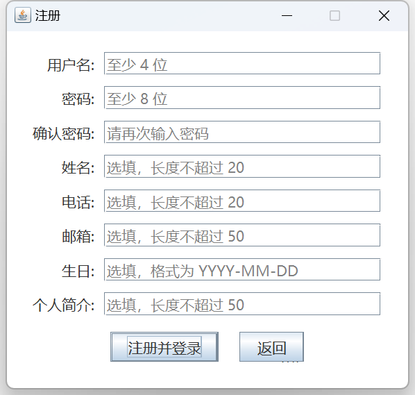

# 社交日历

2023 春 Java 程序设计大作业——社交日历。

程序分为客户端和服务端，支持好友间的即时通讯和个人日常信息管理，同时日常信息可以设置是否对好友可见，好友间可以查看对方公开的日常信息。

## 特性

- **通信**：common 包中的类均实现了序列化接口，使用 Java 内置的序列化和 Socket 进行客户端和服务端的通信。
- **合法性检测**：客户端使用 client.utils.Validators 类对用户输入的信息进行合法性检测后再传给服务端，增强代码的健壮性。
- **密码加密**：客户端使用 SHA-256 对用户的密码加密后传输给服务端，提高安全性。
- **图形化界面**：客户端使用图形化界面与用户交互，界面简洁、美观。使用 client.utils.Converters 类将一些信息转换为简单的表示。
- **测试**：使用 JUnit 测试，确保代码的正确性和健壮性。

## 界面展示

## 使用说明

### 注册：

1. 用户名、密码；选填：姓名、电话、邮箱、生日、个人简介
2. 登录：输入用户名和密码登录
3. 支持修改密码及其他个人信息
4. 数据库：存储以上信息，给每个用户一个用数字表示@的实际 id 方便存储和查询。

### 好友列表：
1. 条目属性：姓名、电话、邮箱、微信号、生日、备注
2. 条目新建、删除、合并
3. 条目查询和现实

### 对话框：

### 会议：
1、数据库：存储用户的好友列表、用户对每个好友的备注姓名。信息的数据库可以参考
https://blog.csdn.net/aixiaoyang168/article/details/49304823
2、GUI：显示给好友的备注、真实的用户名和未读消息数，单击/双击打开聊天框，聊天框旁边可以显示好友资料。
3、支持按用户名查找用户、申请添加好友、同意添加好友
会议：
1、创建一个会议，是一个公共的画图板，旁边可以邀请用户加入和一个聊天框。

### 日历

# 代码结构

### GUI 
### Server

### 分工