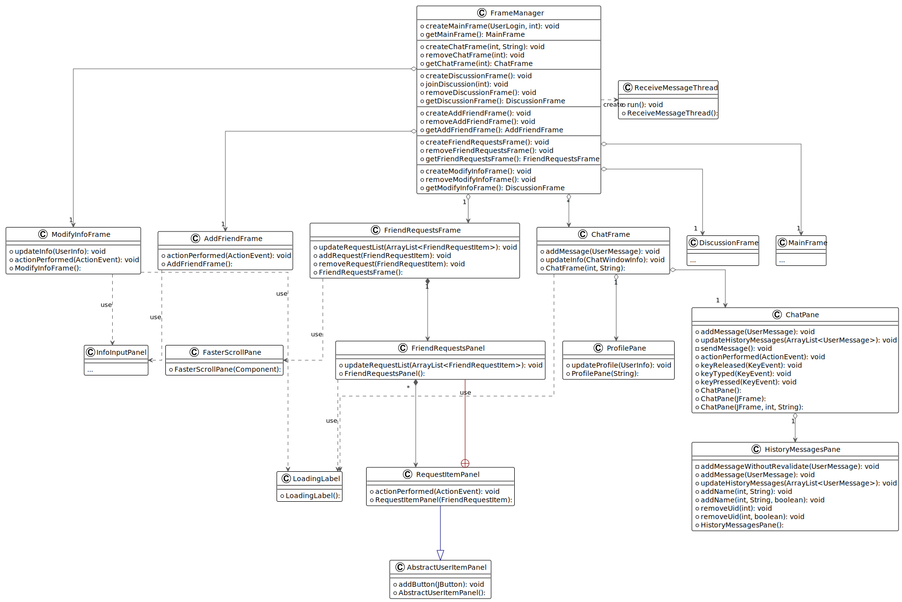
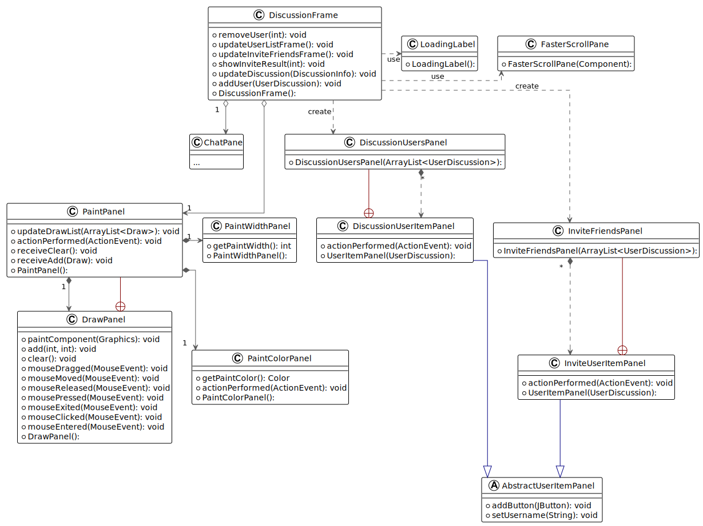

# 社交日历

2023 春 Java 程序设计大作业——社交日历。

程序分为客户端和服务端，支持好友间的即时通讯和个人日常信息管理，同时日常信息可以设置是否对好友可见，好友间可以查看对方公开的日常信息。

## 小组成员与分工

| 姓名  | Gitee 账号                                       | Email                                        | 分工                                                    |
|-----|------------------------------------------------|----------------------------------------------|-------------------------------------------------------|
| 孟煜皓 | [AutumnKite](https://gitee.com/AutumnKite)     | [autumnkite233@gmail.com](mailto:autumnkite233@gmail.com) | 客户端的登录、注册、好友列表、聊天、修改信息、好友申请、在线讨论部分，及与之相关的公共类、工具类      |
| 朱羿恺 | [uyom](https://gitee.com/uyom)                 | [hjeAKNOI@gmail.com](mailto:hjeAKNOI@gmail.com) | 服务器端的处理登录、注册、好友列表、聊天、修改信息、好友申请、在线讨论请求部分，及与之相关的公共类、工具类 | 
| 张轩熙 | [Xuanxi Zhang](https://gitee.com/xuanxi-zhang) | [xuanxizhang2000@gmail.com](mailto:xuanxizhang2000@gmail.com) | 客户端日历相关功能的实现及GUI，及与之相关的公共类、工具类                                     |
| 蒋敬 | [FengWu](https://gitee.com/FengWu-PKU) | 2000013727@stu.pku.edu.cn | 数据库的建表和接口函数 |
## 特性

- **通信**：common 包中的类均实现了序列化接口，使用 Java 内置的序列化和 Socket 进行客户端和服务端的通信。
- **合法性检测**：客户端使用 client.utils.Validators 类对用户输入的信息进行合法性检测后再传给服务端，增强代码的健壮性。
- **密码加密**：客户端使用 SHA-256 对用户的密码加密后传输给服务端，提高安全性。
- **图形化界面**：客户端使用图形化界面与用户交互，界面简洁、美观、易用。使用 client.utils.Converters 类将一些信息转换为简单的表示。
- **测试**：部分重要的类使用 JUnit 测试，确保代码的正确性和健壮性。
- **数据**：所有数据都存储在远程数据库，只在需要时从数据库中取出，对用户本机内存友好
## 功能

- [x] 登录：输入用户名、密码登录。
- [x] 注册：用户名、密码必填，姓名、电话、邮箱、生日、个人简介选填。
- [x] 好友列表
  - [x] 每个好友条目显示给好友的备注、真实的用户名、上一条消息、上一条消息的时间、未读消息数。
  - [x] 单击显示好友日历。
  - [x] 双击打开聊天框。
  - [x] 右键菜单中可以选择修改好友备注和删除好友。
  - [x] 发送消息、删除好友实时更新自己与对方的好友列表。
  - [x] 右键菜单中有打开聊天选项，可以在不更新日历面板的情况下打开聊天窗口。
- [x] 聊天窗口
  - [x] 显示最近的 50 条历史聊天记录。
  - [x] 右侧显示好友个人资料。
  - [x] 点击发送按钮或按 Enter 发送消息。按 Ctrl+Enter 换行。
  - [x] 实时在聊天记录中显示发送的消息与对方发送的消息。
  - [x] 更新自己及对方的好友列表。
  - [x] 消息分为已读与未读。
- [x] 修改信息
  - [x] 修改姓名、电话、邮箱、生日、个人简介
  - [x] 修改密码
- [x] 添加好友
  - [x] 根据用户名查找用户。
  - [x] 向服务端查询是否申请成功并显示成功或错误消息。
  - [x] 实时更新对方的好友申请列表。
- [x] 好友申请列表
  - [x] 每个申请条目显示同意和拒绝按钮。
  - [x] 同意后实时更新自己与对方的好友列表。
- [x] 在线讨论
  - [x] 创建在线讨论
    - [x] 若已经在讨论中，无法创建。
  - [x] 用户列表
    - [x] 用户列表未加好友的用户条目显示“加为好友”按钮。
    - [x] 用户列表实时更新。
  - [x] 邀请好友加入
    - [x] 不显示已在当前讨论中的好友。
    - [x] 向服务端查询该好友是否可以被邀请（在线且不在其他讨论中）。
    - [x] 好友客户端弹出邀请窗口，确认是否加入。
    - [x] 好友关系变动后实时更新。
  - [x] 画图板
    - [x] 讨论中的用户均可以画图。画图板实时更新。
    - [x] 修改画笔颜色和粗细。
    - [x] 清空画图板。
  - [x] 聊天室
    - [x] 讨论中的用户均可以发送消息。聊天记录实时更新。
    - [x] 清空聊天室。
  - [x] 加入在线讨论
    - [x] 若已经在其他讨论中，无法加入。
    - [x] 若该讨论已结束，显示讨论已结束消息。
    - [x] 加入后显示画图板中已有笔迹和聊天室中已有聊天记录。
    - [x] 其他用户的聊天室中显示新用户加入消息。
    - [x] 更新用户列表和邀请好友列表。
  - [x] 退出在线讨论
    - [x] 其他用户的聊天室中显示用户退出消息。
    - [x] 更新用户列表和邀请好友列表。
- [x] 日历
  - [x] 日历显示
    - [x] 日历为4*7格，显示四个星期的内容。
    - [x] 默认将当天放在第二行。
    - [x] 可以在页底选择日期，切换日历显示范围，将选择的日期放在第二行。
  - [x] TodoList
    - [x] 登陆后首先显示自己的待办事项。
    - [x] 每个小框中显示以当天为截止日期的待办事项。
  - [x] 新建与编辑
    - [x] 轻点日期可以新建以当天为截止日期的待办事项。
    - [x] 轻点事项会弹出修改内容的对话框。
    - [x] 在对话框中，可以修改待办事项的标题、内容、公开性。
  - [x] 社交属性
    - [x] 点击好友，可以选择查看好友的待办事项。
    - [x] 右击好友，选择显示日历，也可以查看好友的日历。
    - [x] 只可查看好友设置为公开的待办。
    - [x] 不能编辑好友的待办。

## 运行

在服务器上运行 server/Server.java，客户端上运行 client/SocialApp.java。

## 界面展示

## 代码结构

### 客户端类图

连接服务器、登录、注册：

各个窗口及窗口管理器：

在线讨论：

### 服务端类图

## 扩展

可以扩展的方向有：

- 聊天发送表情、文件。
- 加入头像功能，仿照 QQ、微信展示聊天记录。
- 将在线讨论加入数据库，类似“群聊”功能，实现在线讨论的用户、画板、聊天记录不丢失。群也可以有对应的日历。
- 增加待办事项的搜索功能。
- 可以增加记账本功能(后端的数据库和接口函数已支持)。
- 在用户本机开辟一个缓存区，用于存放被频繁使用的数据，这样就不用每次都从服务器上获取，加快了响应速度，同时减轻了服务器的负载，但会占用用户本机的内存空间。
